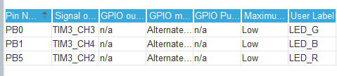
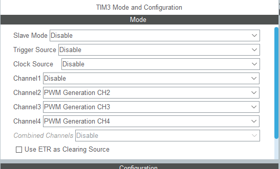
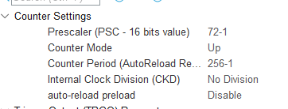
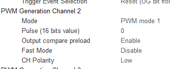

# STM32F103VE LED

## CubeMX Settings

1. Set the lights ports and pin to timer channel

2. Set label of the red light to LED_R, and same to the green and blue one

   

3. Set every channel to `PWM Generation CHx`

   

4. In timer parameter settings, set the prescaler to 72-1, and counter period to 265-1. 

   

5. Then set the polarity of every light to low

   

6. Generate Code. 

7. Enable the PWM. 

   ```C
     HAL_TIM_PWM_Start(&htim3, TIM_CHANNEL_2);
     HAL_TIM_PWM_Start(&htim3, TIM_CHANNEL_3);
     HAL_TIM_PWM_Start(&htim3, TIM_CHANNEL_4);
   ```

   


## Usage

It's okay to just use GPIO to control the LED lights. 

On the board, the 3 colors of lights are in one light so that you can control the single one to set the color of the light. 

There are 2 modes written in the code. One is for GPIO controlling and the other is for PWM controlling. 

To set the mode, you can simply comment the 19th and 20th lines in the header file like this:

```c
// #define LED_GPIO_OUT // comment this line if you use pwm, uncomment this line if you use gpio output
#define LED_PWM_OUT  // comment this line if you use gpio output, uncomment this line if you use pwm
```

After setting the mode, you can use the functions to control the lights. 

- GPIO Output Mode

  - The functions are these:

     1. `LED_R_ON() ` Turn on the red light
     2. `LED_R_OFF()` Turn off the red light
     3. `LED_R_TOGGLE()` toggle the red light
     4. `LED_G_ON()` Turn on the green light
     5. `LED_G_OFF()` Turn off the green light
     6. `LED_G_TOGGLE()` toggle the green light
     7. `LED_B_ON()` Turn on the blue light
     8. `LED_B_OFF(` turn off the green light
     9. `LED_B_TOGGLE()` toggle the blue light

  - You can turn on not only one light to get more colors.

    |   +   | Red  | Blue | Green |
    | :---: | :--: | :--: | :---: |
    |  Red  |      |      |       |
    | Blue  |      |      |       |
    | Green |      |      |       |

- PWM Output Mode

  - The functions are these:
  
    1. `LED_RGB(uint8_t r, uint8_t g, uint8_t b)` Set the color with RGB values.
    2. `LED_Hex(uint32_t hex)` Set the color with a hex value
  
  - And there are built-in hex values of some commonly used colors. 
  
    | Hex Value | Color |
    | :-------: | :---: |
    | 0xFFFFFF  | white |
    | 0xFF0000 | red |
    | 0x00FF00 | green |
    | 0x0000FF | blue |
    | 0x000000 | turn off the light |
    
    
  
  